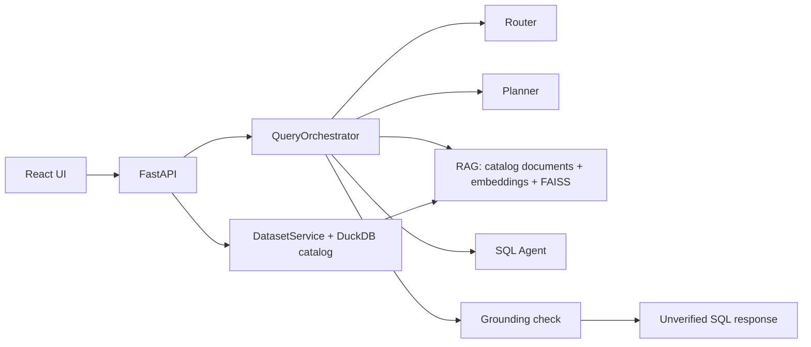

# Architecture



Phase 1 remains in `core.py`, `routes.py`, `service.py`, `db.py`, and `schemas.py`. `providers.py` defines LLM and embedding protocols with a local Ollama HTTP implementation. `agents.py` owns Router, Planner, SQL, Repair and Synthesis prompts. `rag.py` creates deterministic table/column documents and a per-dataset FAISS index. `query_service.py` coordinates stages; `sql_guard.py` owns approval; `executor.py` owns read-only execution; `result_ops.py` profiles rows and chooses charts. The frontend talks only to `api.ts`.

Trusted data flows from the DuckDB catalog to agent prompts and retrieval documents. User questions, model output, and retrieved descriptions are untrusted. The Planner sees a compact catalog summary before retrieval; its references are checked against catalog truth. Planner-guided retrieval supplies bounded evidence to the SQL Agent. Every initial or repaired SQL statement passes the same AST guard before a read-only DuckDB connection executes it. Only executed rows feed synthesis and chart planning. Phase 4 cache, conversations, RBAC, and evaluation remain planned.

```text
React → FastAPI → Query Orchestrator
                  Router / Planner / RAG / SQL Agent / Repair Agent (Ollama)
                  ───── deterministic trust boundary ─────
                  SQLGlot Guard → ApprovedQuery → Read-only DuckDB
                                               ↓
                  Result Profiler → Synthesizer (Ollama) → Deterministic Chart Planner → Response
```

The trust boundary is crossed only by an `ApprovedQuery` from the guard. Synthesis receives executed rows; chart selection uses typed result metadata and no generated frontend code.

Ingestion remains a trusted application write: upload → fixed format reader → generated DuckDB table → profile → catalog transaction. No HTTP endpoint accepts arbitrary SQL. The catalog is authoritative; FAISS is a rebuildable candidate index. Stored indexes are checked against dataset ID, content version, schema hash, embedding model/dimension, document count, and document identities before use.
