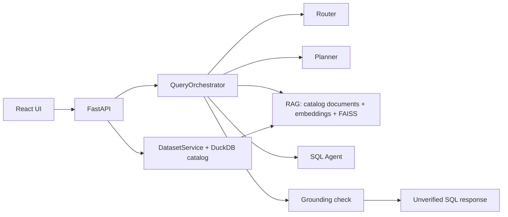

# Architecture

Phase 1 remains in `core.py`, `routes.py`, `service.py`, `db.py`, and `schemas.py`. `providers.py` defines LLM and embedding protocols with one OpenAI-compatible HTTP implementation. `agents.py` owns three focused prompts. `rag.py` creates deterministic table/column documents and a per-dataset FAISS index. `query_service.py` coordinates stages; it contains no provider or FAISS internals. The frontend talks only to `api.ts`.

Trusted data flows from the DuckDB catalog to agent prompts and retrieval documents. User questions, model output, and retrieved descriptions are untrusted. The Planner sees a compact catalog summary before retrieval; its references are checked against catalog truth. Planner-guided retrieval then supplies bounded evidence to the SQL Agent. Agent output cannot authorize execution. Phase 2 stops at `GeneratedSQL` plus a grounding check and returns `unverified` with no result table. Phase 3 can replace that stop with a deterministic SQL AST/policy guard followed by a separate read-only executor; repaired SQL must traverse the same guard.

Ingestion remains a trusted application write: upload → fixed format reader → generated DuckDB table → profile → catalog transaction. No HTTP endpoint accepts arbitrary SQL. The catalog is authoritative; FAISS is a rebuildable candidate index. Stored indexes are checked against dataset ID, content version, schema hash, embedding model/dimension, document count, and document identities before use.
